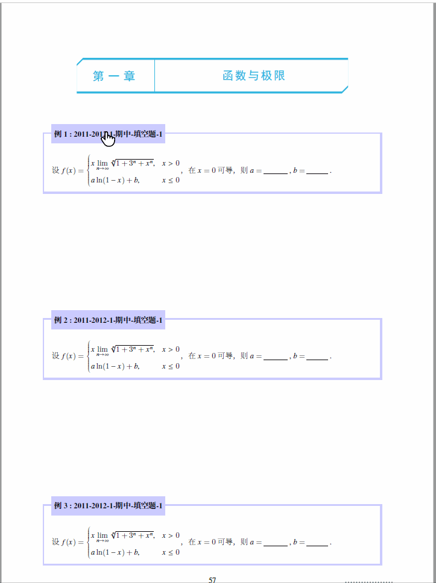

# 高等数学教材解析与习题指导

## 获取 PDF
请到 [这里](https://github.com/htharoldht/Resolutions-of-Advanced-Mathematic/raw/master/HTNotes-Demo.pdf) 获取

## 几点注意事项

- 由于时间仓促, 上册的排版做得不尽人意, 虽然已经花费了很多的时间, 但是最近实在是没有心情去调整

- 计划于 2018 年国庆放假回来正式发布

## 获取源码
请到 [这里](https://github.com/htharoldht/Resolutions-of-Advanced-Mathematic) 下载

## 本书支持动态效果

不过需要用 Adode 系列的 PDF 阅读器, 该阅读器是最强大、最原生且支持最好的.
请到 [这里](https://acrobat.adobe.com/cn/zh-Hans/acrobat/pdf-reader.html) 下载.